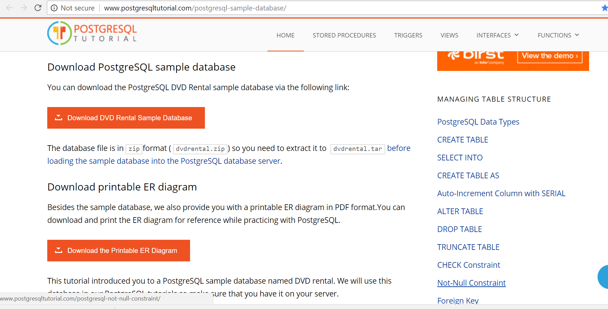
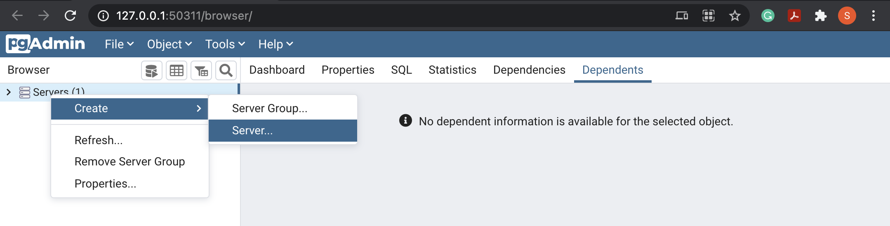
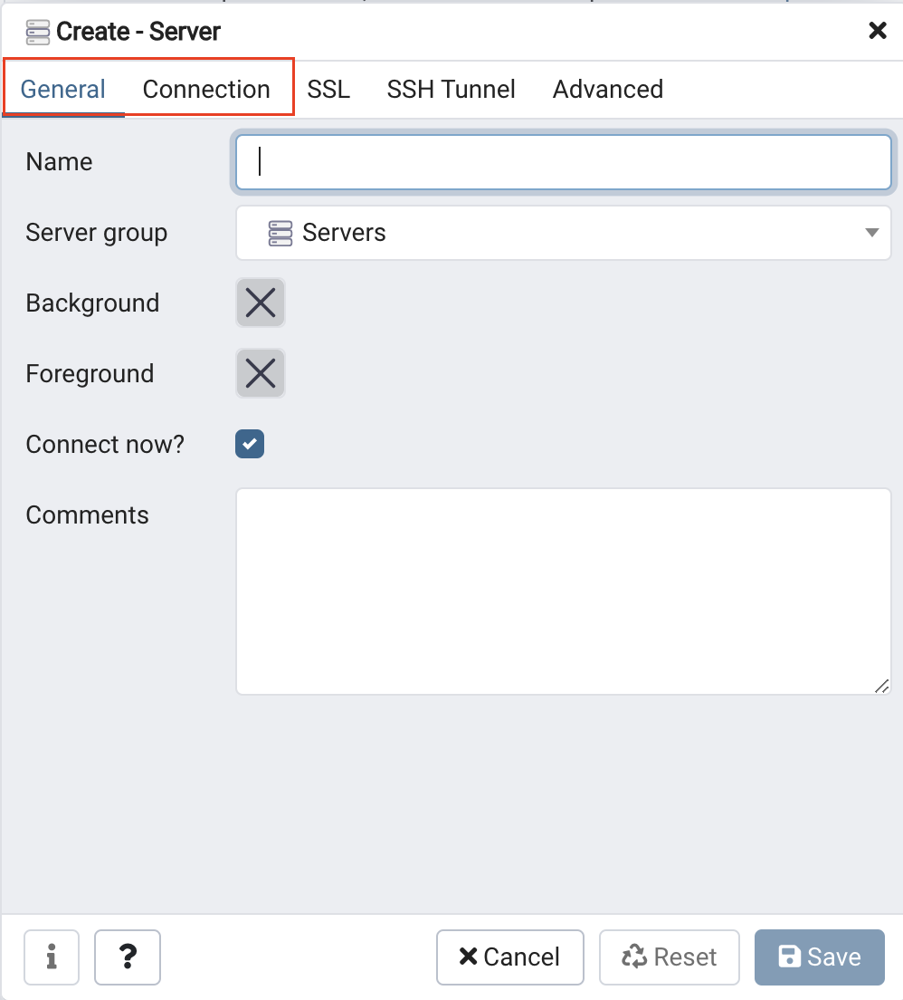
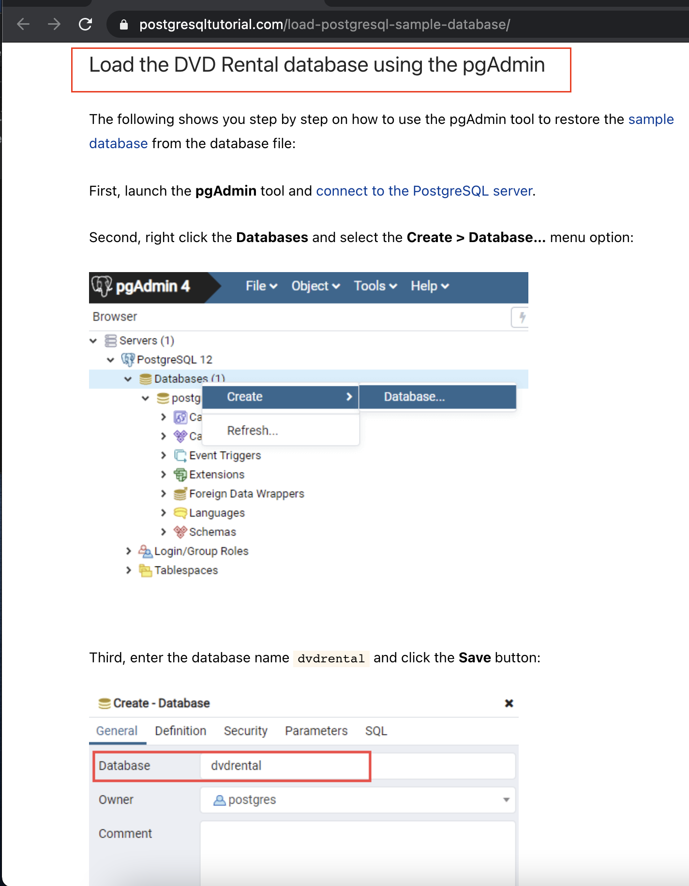
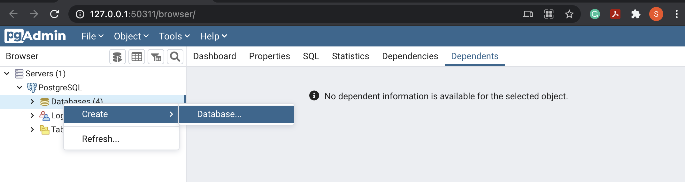
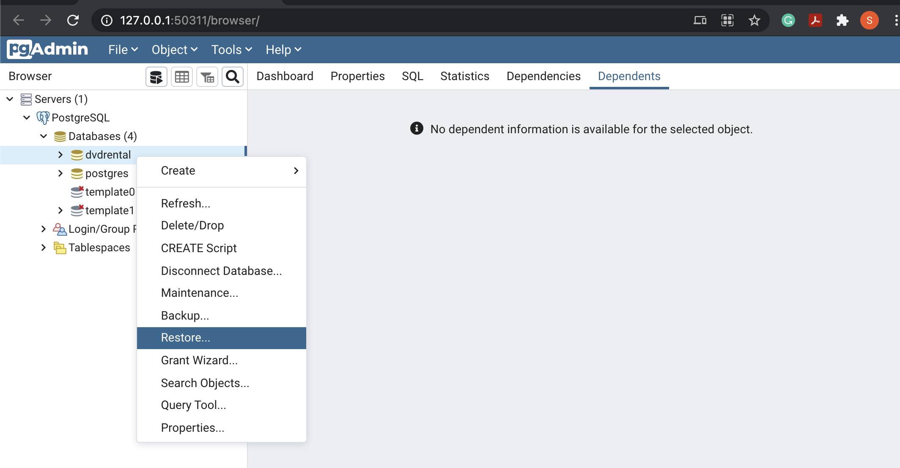
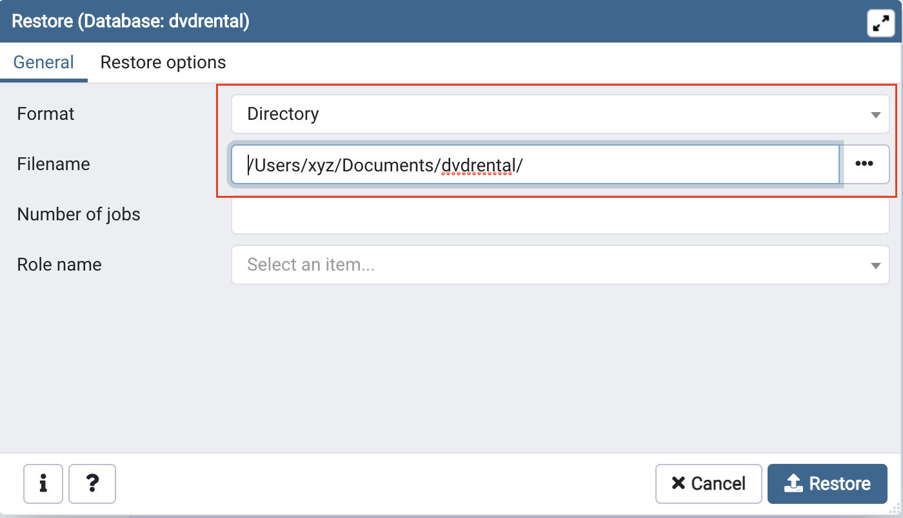
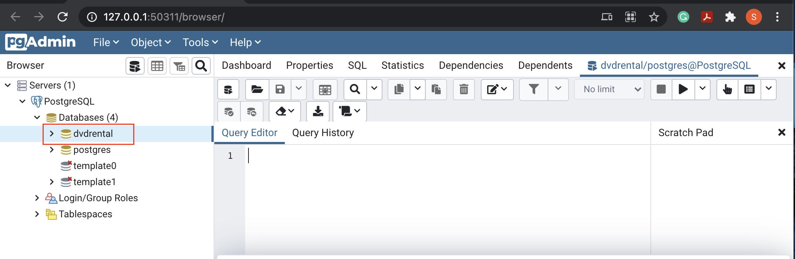
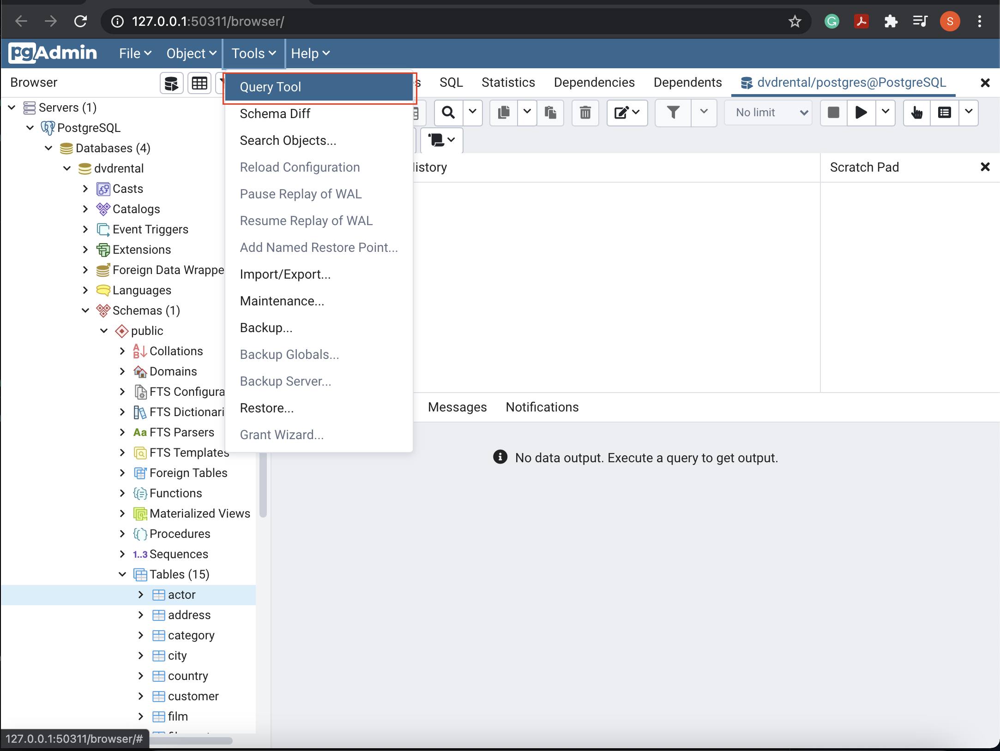
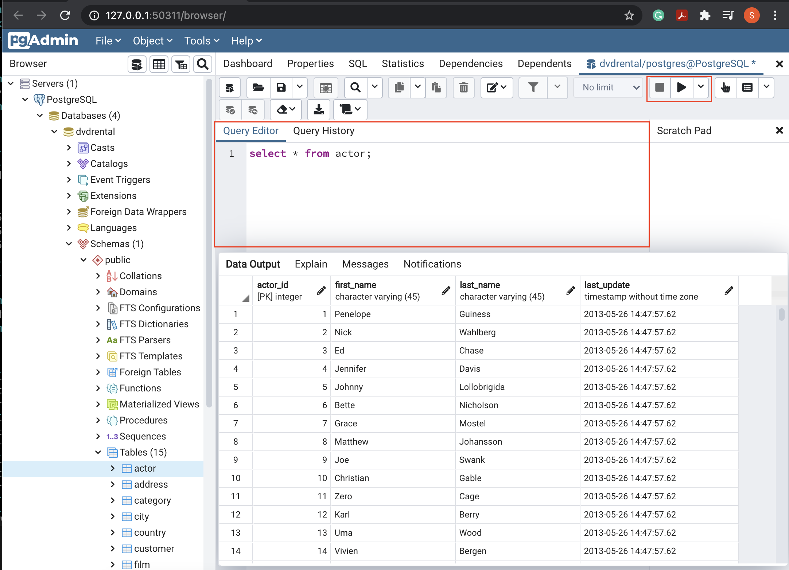

## Date created
2021-10-11

## Project Title
Sakila DVD Rental database

## Description
In this project, we query the Sakila DVD Rental database. The Sakila Database holds information about a company that rents movie DVDs. 
For this project, we are querying the database to gain an understanding of the customer base, such as what the patterns in movie watching are across different customer groups, how they compare on payment earnings, and how the stores compare in their performance. 

(Note: One quirk you may notice as you explore this "fake" database is that the rental dates are all from 2005 and 2006, 
while the payment dates are all from 2007.)

- The "queries.txt" file has the questions used to query the database for analysis and also the corresponding SQL queries to generate the output for each question.

- The "report.pdf" file has the visualization for the above analysis.

- Both "DVD-Rental-ERD.pdf and DVD-Rental-ERD.png" files are ERDs for the Sakila DVD Rental database.

## Software Requirements
PostgreSQL - object-relational database management system

## Setting up your local environment

Step 1. Downloading PostgreSQL

First, you will need to install PostgreSQL on your local machine. 
Select the following three components during installation - PostgreSQL server, pgAdmin, and command-line tools. 
pgAdmin is a GUI tool for managing the database. Download the installer from the link below, and install with the admin privileges:

- Installing PostgreSQL for Windows: 
  [https://www.postgresql.org/download/windows/](https://www.postgresql.org/download/windows/)

- Installing PostgreSQL for Mac OS:
  [https://www.postgresql.org/download/macosx/](https://www.postgresql.org/download/macosx/) 

Step 2. Downloading Sakila database

Once PostgreSQL server is installed, you will need to download the Movie database from this page: [PostgreSQL Sample Database](https://www.postgresqltutorial.com/postgresql-sample-database/)

Scroll down and click on the orange "Download DVD Rental Sample Database" button.

This will download a zipped file, and you will need to extract the dvdrental.tar file.

Step 3. Connect to the PostgreSQL server

Launch pgAdmin tool, a graphical tool for managing and developing PostgreSQL databases. 
The PostgreSQL interactive installer by EDB includes the pgAdmin by default. If you have a native PostgreSQL installation, you can download pgAdmin from [here](https://www.pgadmin.org/download/). 
It will take some time to launch the pgAdmin tool. Let's connect the pgAdmin to the PostgreSQL server.

- Within the Object browser (left-navigation pane), right-click on the Servers → Create → Server... option.

Connect to a PostgreSQL server

- It will open up a dialog box asking for the PostgreSQL server name, and credentials for the “postgres" superuser. See the snapshot below.

Provide server details

Provide the following details, and leave the other fields as default.

|Tab	|Field	|Value|
|:------|:------|:----|
|General|	Name|	**PostgreSQL**|
|Connection|	Host name|	**localhost**|
|       |Post	|**5432 (default)**|
||Username|	**postgres**|
||Password|	As you have chosen while installation|

All steps are also mentioned here - [connect to the PostgreSQL server](https://www.postgresqltutorial.com/connect-to-postgresql-database/).

Step 4. Loading database

The next step is to load the DVD Rental database into your PostgreSQL server on your machine. 
Follow the instructions on the page - [Load PostgreSQL Sample Database](http://www.postgresqltutorial.com/load-postgresql-sample-database/) (scroll down ⅓ on this page). 
There are two ways to load the database:

- Load the sample database using psql tool
- Load the DVD Rental database using the pgAdmin

We will use the Load the DVD Rental database using pgAdmin tool method. See the snapshot below.

A snapshot from [https://www.postgresqltutorial.com/load-postgresql-sample-database/](https://www.postgresqltutorial.com/load-postgresql-sample-database/)

## The general steps to load the sample database into your local PostgreSQL database server are:

1. Create a blank database, with the name dvdrental.

Create an empty database
2. Restore the data from the locally downloaded Sakila database.

Restore the database

3. You need to have either the unzipped data folder or the tar format file locally. Choose the desired source format and the path of the file/folder.

Provide source format and path

Step 5. Choose the DVD Rental database

Once, you have restored the database, you are all set to use it. Choose the dvdrental database under Databases (left-navigation pane).

Choose the database

Step 6. Running Queries on your dvdrental database

Ready to run some queries??
Open the Query tool, write your queries in the Query editor, and run them to see your data output. See the snapshots below.

Open Query tool

Query editor pane

## Files used
- queries.txt 
- DVD-RENTAL-ERD.png
- DVD-RENTAL-ERD.pdf
- report.pdf
- *.png

## Credits
Udacity Instructor:- Derek Steer (CEO : MODE). 